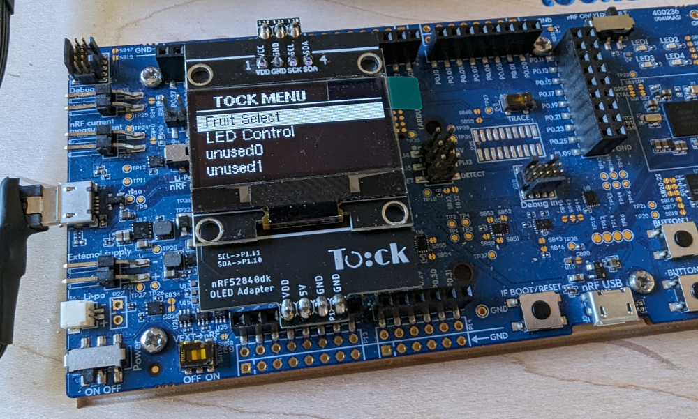
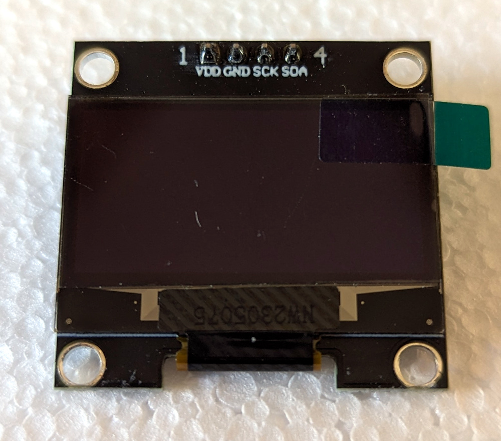
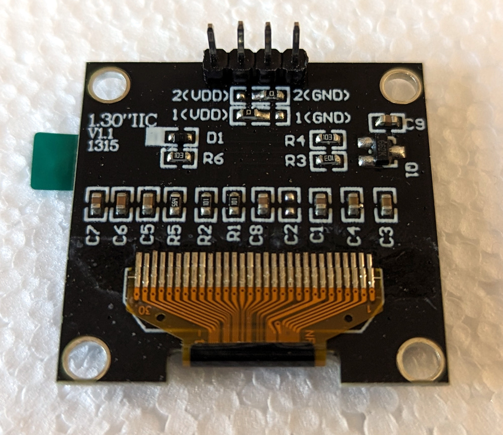
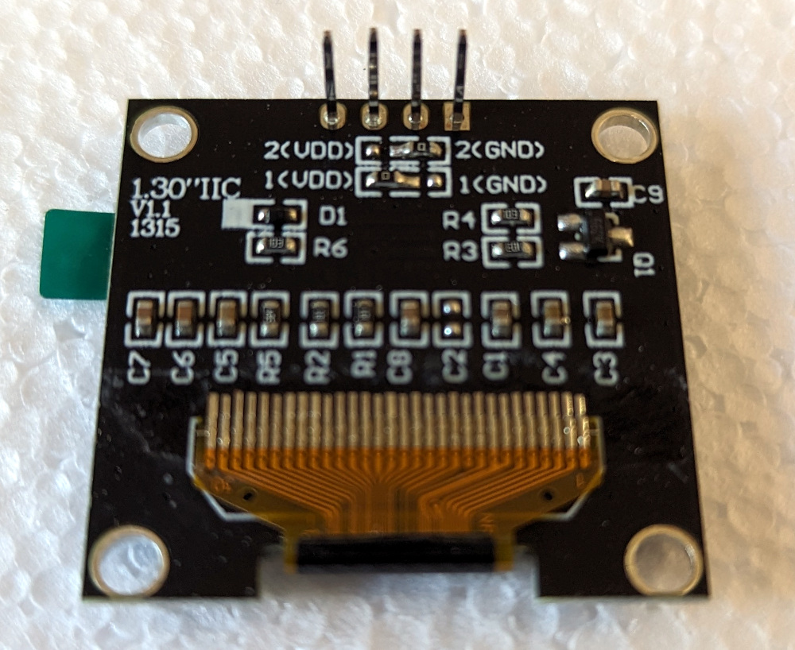
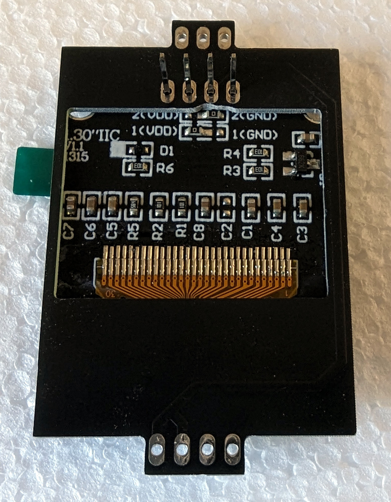
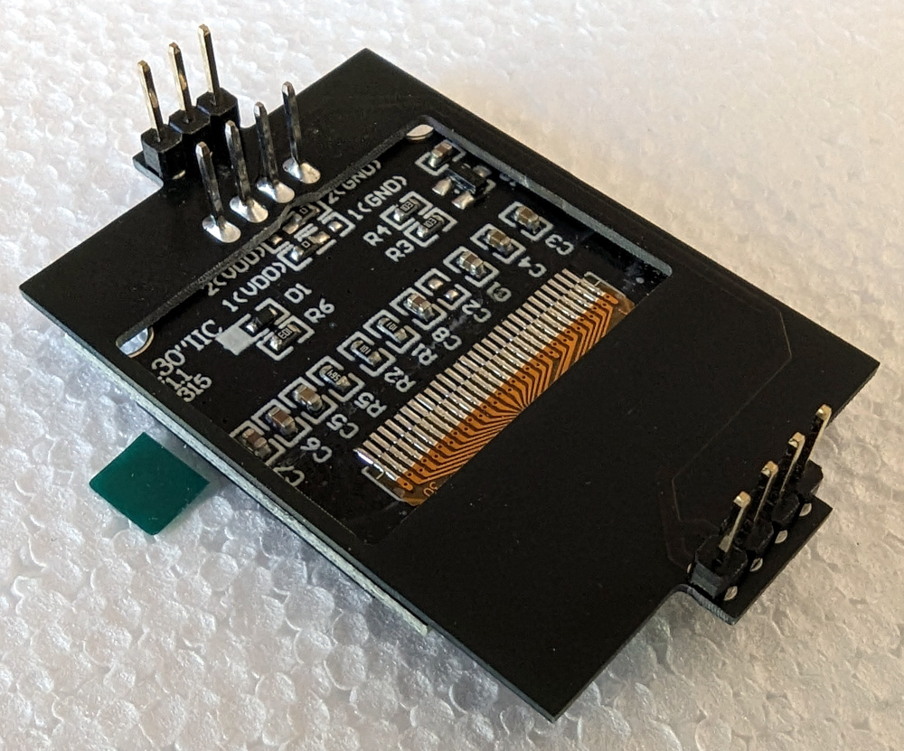
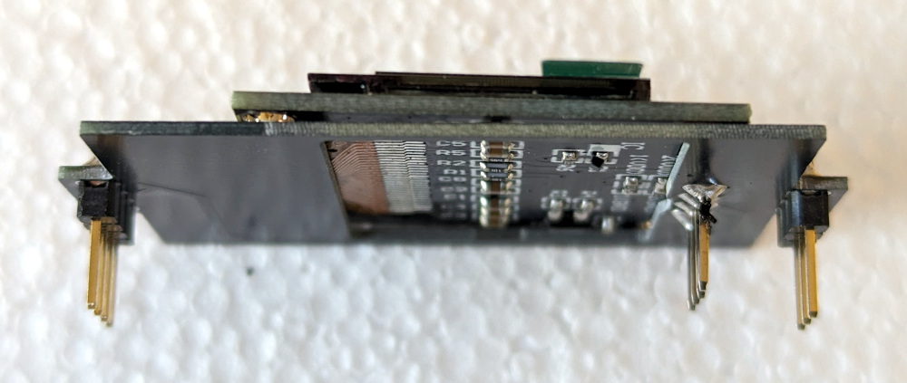
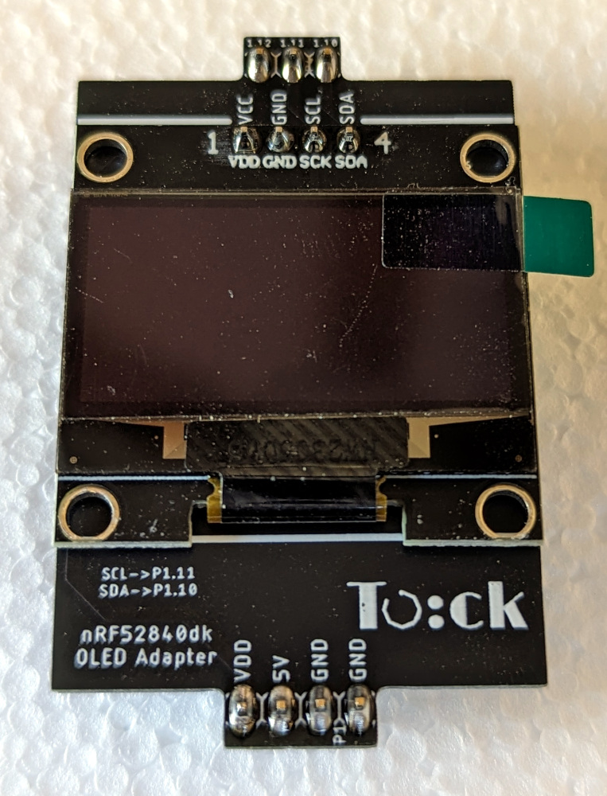

nRF52840dk OLED Screen
======================

This is a adapter for connecting a small OLED display to the nRF52840dk board.

This plugs into the Arduino headers on the nRF52840dk, so it should be
compatible with any board with Arduino-style headers.

## Parts

To build this, you need:

1. A 1.3" OLED display with the SSD1315 driver, I2C interface, and pin order
   VCC-GND-SCK-SDA. We used [this
   screen](https://www.aliexpress.us/item/3256803932062947.html).
2. The custom adapter [PCB](./pcb).
3. One 1x3 0.1" header. We used [this
   part](https://www.digikey.com/en/products/detail/w%C3%BCrth-elektronik/61300311121/4846825).
4. One 1x4 0.1" header. We used [this
   part](https://www.digikey.com/en/products/detail/w%C3%BCrth-elektronik/61300411121/4846827).
5. A soldering iron, solder, and perhaps other PCB assembly tools.

## Instructions

These are the detailed assembly instructions.

1.  Start with the OLED display.

    

    See the 0.1" headers plastic spacer on the underside:

    

    Remove the plastic spacer so the screen looks like:

    

2.  Solder the screen flush on top of the adapter PCB.

    If you haven't done a lot of through-hole header soldering, the easiest way
    is to hold the pieces in place, and get enough solder on one pin to hold the
    part in place. It is usually best to pick one of the pins on the end. The
    solder does not have to be pretty. Then, solder a _different_ pin, probably
    the one on the other end. Don't choose a pin adjacent to the fist. Because
    the first pin holds the pieces together, your hands are freed up to get the
    solder nicely applied. Once you have two pins soldered, you can solder the
    remaining pins, including cleaning up the original pin solder joint.

    

3.  Solder the two 0.1" headers to the bottom of the adapter board.

    

    You should have a stack like this:

    

4.  The OLED adapter is ready!

    

## Attach to the nRF52840dk

The adapter board plugs in the Arduino-style headers. The three pins plug into
the `P1.10`, `P1.11`, and `P1.12` positions. The four pins plug into the header
on the other side. There is one empty pin on the female header (the pin labeled
`N.C.` remains empty).
