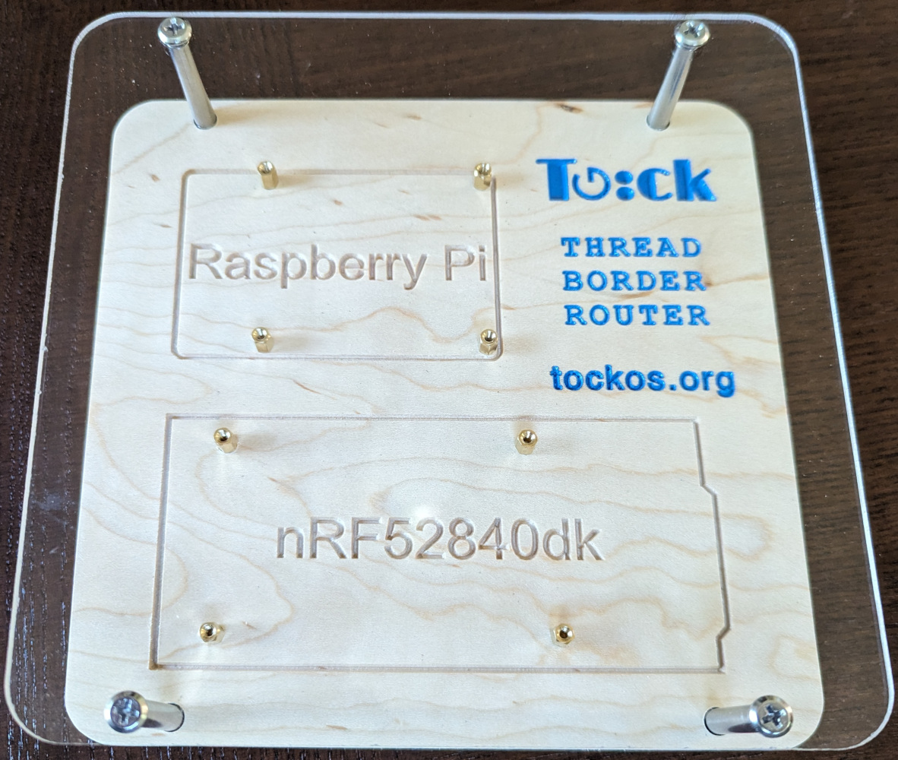
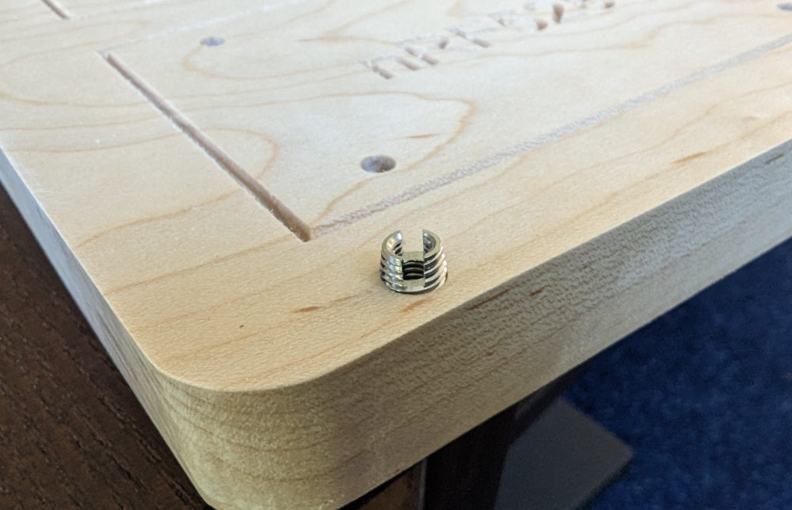
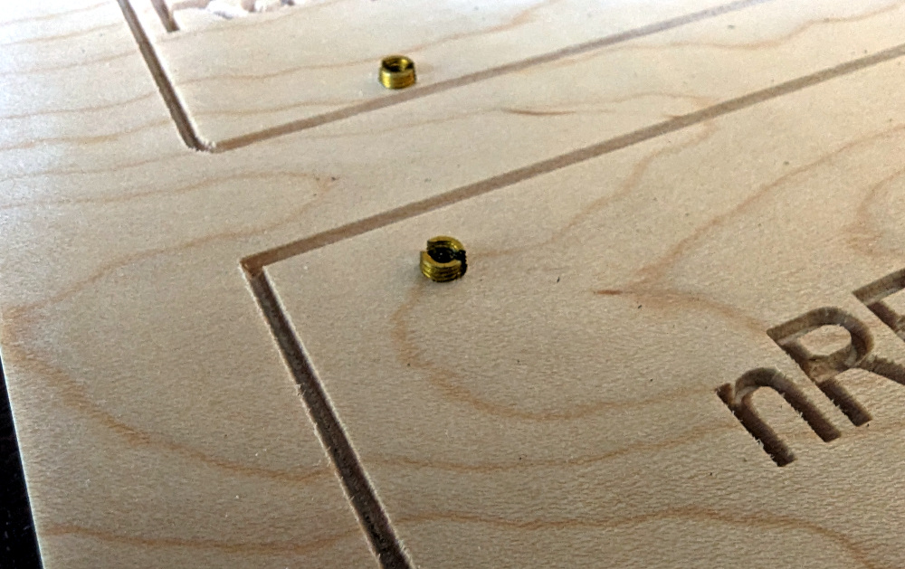
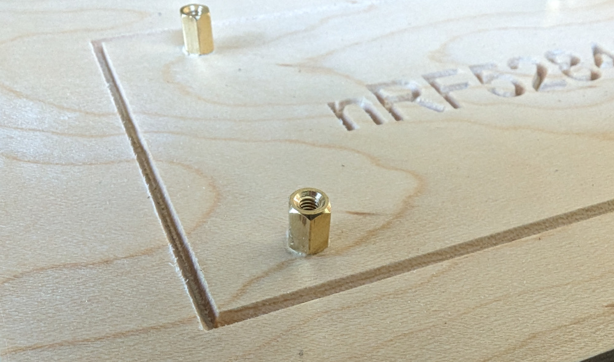
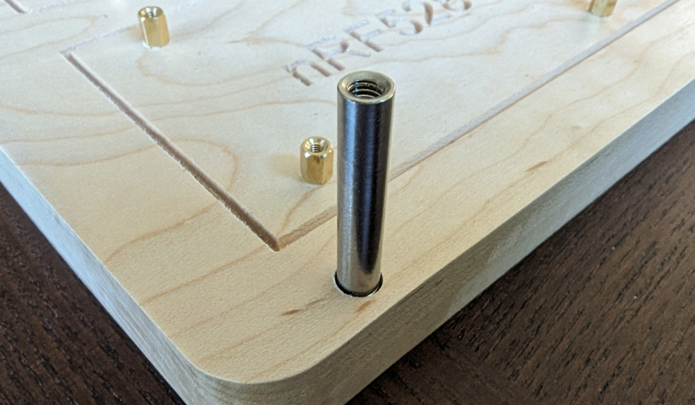
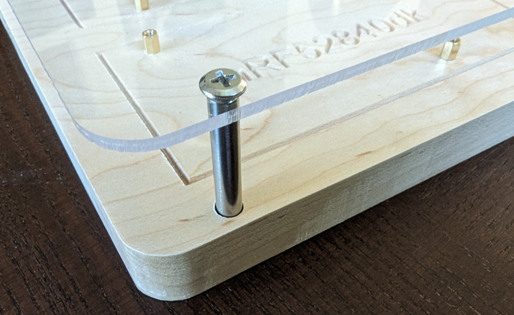

Tock Thread Border Router Base
==============================

This hardware base hosts a Raspberry Pi and an nRF52840dk for running a Thread
network.

## Parts

1. The base itself. Design files are in the `/cad` folder. Design is cut from a 1x8 maple board.
2. 4x M4xM6.5x8mm [threaded inserts](https://www.aliexpress.us/item/3256803925467814.html).
3. 4x M4x30mm [standoffs](https://www.aliexpress.us/item/3256805724677092.html).
4. 4x M4x10mm [screws](https://www.amazon.com/dp/B09CV16W5T).
5. 8x M2.5xM4.5x6mm [threaded inserts](https://www.aliexpress.us/item/3256803925467814.html)
6. 8x M2.5x6mm [standoffs](https://www.aliexpress.com/item/3256802766024100.html).
7. 8x M2.5x6mm [screws](https://www.aliexpress.us/item/2251832785207012.html).
8. The lid. Design files are in the `/cad` folder. Design is cut from 1/8" acrylic.

## Instructions

1.  Start with the base. Screw in four M4x8mm threaded inserts around the
    perimeter of the base.

    

2.  Screw in eight M2.5x6mm threaded inserts, four for the Raspberry Pi and four
    for the nRF52840dk.

    

3.  Screw in eight M2.5x6mm standoffs into each of the M2.5 threaded inserts.

    

4.  Screw in four M4x30mm standoffs into the perimeter M4 threaded inserts.

    

5.  Install the RPi and nRF52840dk boards with the M2.5 screws.

6.  Attach the cover with four M4 screws.

    
